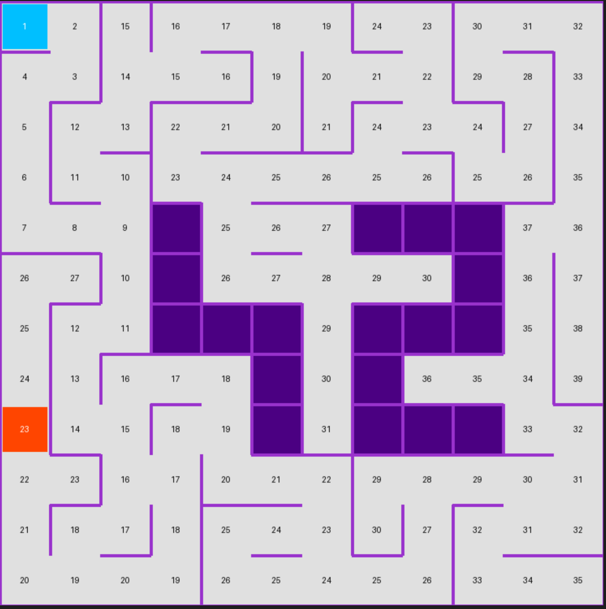

*__This project has been created as part of the 42 curriculum by nbarbosa and nbilyj.__*

# A-Maze-ing

A-Maze-ing is a maze generator and solver written in Python. This project explores graph theory, procedural generation, and the creation of reusable Python packages. It allows for the generation of perfect or imperfect mazes, solving them via a shortest-path algorithm, and exporting the results in both text and visual formats.

## Description

The program reads a configuration file, generates a maze based on specific constraints (dimensions, start/end points, loops), and produces two main outputs:

    Text File: Contains the hexadecimal representation of the maze and the cardinal solution (N, S, E, W).

    Visualization: A terminal render of the maze.

## Installation & Usage

### Makefile

A Makefile is included to automate common tasks:
```makefile
make install: Installs dependencies via pip.

make run: Runs the main script with the default configuration.

make lint: Checks code quality (Flake8 and strict MyPy).

make clean: Removes temporary files and caches.
```
### Manual Execution

To run the generator with a specific config file:
```Bash
python3 a_maze_ing.py config.txt
```
### Configuration

The configuration file (config.txt) defines the maze parameters using a KEY=VALUE format.  
Lines starting with # are ignored.  

##### Key Description Example Required  
WIDTH	Maze width (cells):						__WIDTH=20__  
HEIGHT	Maze height (cells):					__HEIGHT=15__  
ENTRY	Start coordinates (x,y):				__ENTRY=0,0__  
EXIT	End coordinates (x,y):					__EXIT=19,14__  
PERFECT	True for unique path, False for loops:	__PERFECT=True__  
OUTPUT_FILE	Output text filename:				__OUTPUT_FILE=output_maze.txt__  
SEED Random generation seed: 					__SEED=123456__    

### Algorithms

__Generation: Recursive Backtracker (DFS)__

    I chose the Recursive Backtracker algorithm.

    Aesthetics: Produces long, winding corridors with a low "river factor," making it harder for humans to solve.

    Connectivity: Mathematically guarantees that every cell is accessible (Perfect Maze).

    Implementation: Efficiently implemented using a standard stack structure.

__Solver: Breadth-First Search (BFS)__

    I used BFS for the solver.

    Reasoning: Unlike DFS, which just finds a path, BFS guarantees finding the shortest path in an unweighted grid, which is a requirement for the optimal solution output.


#### Code Reusability

The core generation logic is encapsulated in the mazegen package located at the root. This module is standalone and designed to be imported into other projects. It can be built (wheel/tar.gz) using standard tools.

## Instructions

### Usage Example:

```python
from mazegen import MazeGenerator
```

### 1. Instantiation
Dimensions are defined once and stored within the object instance.  
```python
maze = MazeGenerator(width=20, height=20)
```

### 2. Generation
```python
generate_maze(entry, exit, perfect)
``` 
perfect=True -> generates a perfect maze with a single unique path (no loops).  
```python
maze.generate_maze(entry=(0, 0), exit=(19, 19), perfect=True)  
```

### 3. Resolution
```python
solve_maze(start, end)  
```
Finds the shortest path using Breadth-First Search (BFS).  
Returns a list of coordinates: [(x1, y1), (x2, y2), ...]  
```python
path = maze.solve_maze(start=(0, 0), end=(19, 19))  
```
### 4. Access Internal Structure
The grid is accessible as a 2D list of integers (bitwise representation of walls).
```python
print(maze.grid)
```

### 5. Save the generated maze grid, coordinates, and solution to a text file.
```python
maze.save_maze(filename="output_maze.txt", path=path, entry=(0, 0), exit=(19, 19))
```

#### Features

"42" Pattern: A dedicated algorithm embeds a solid "42" wall structure in the center of the maze (if dimensions allow).

Custom Terminal Render: Colorized ASCII output handling walls, borders, and paths.

Interactive Menu: Options to regenerate, toggle solution visibility, or rotate colors.

#### Project Info

##### Author: nbarbosa, nbilyj

nbarbosa: Parsing, maze algorithm, readme, Makefile.  
nbilyj: Visualiser, package creation, refactoring, maze resolution.  
Both members collaborated on all parts via pair-programming.

QA Tools: Flake8, MyPy (strict).

### Development Phases:

Data structure & Config parsing.

MazeGenerator (Backtracker) & Solver (BFS).

"42" pattern integration & Hex output compliance.

Terminal Rendering of the maze.

Refactoring into mazegen package & PEP8 cleanup.

Include docstrings to the code.

### Retrospective:

What worked: The use of dataclasses for configuration simplified the code significantly.

To improve: A GUI using MLX would have been a nice addition compared to the terminal render.

## Resources

References:

https://www.geeksforgeeks.org/dsa/rat-in-a-maze-backtracking-using-stack/

https://en.wikipedia.org/wiki/Maze_generation_algorithm#Recursive_backtracker

https://discuss.python.org/t/maze-creation-in-python/77030/2

### AI Usage:

Debugging complex MyPy strict typing errors.

Documentation & Layout: Assistance in structuring the README, formatting Markdown code blocks.

Generating ASCII assets.

> Note: The core algorithmic logic was implemented manually.